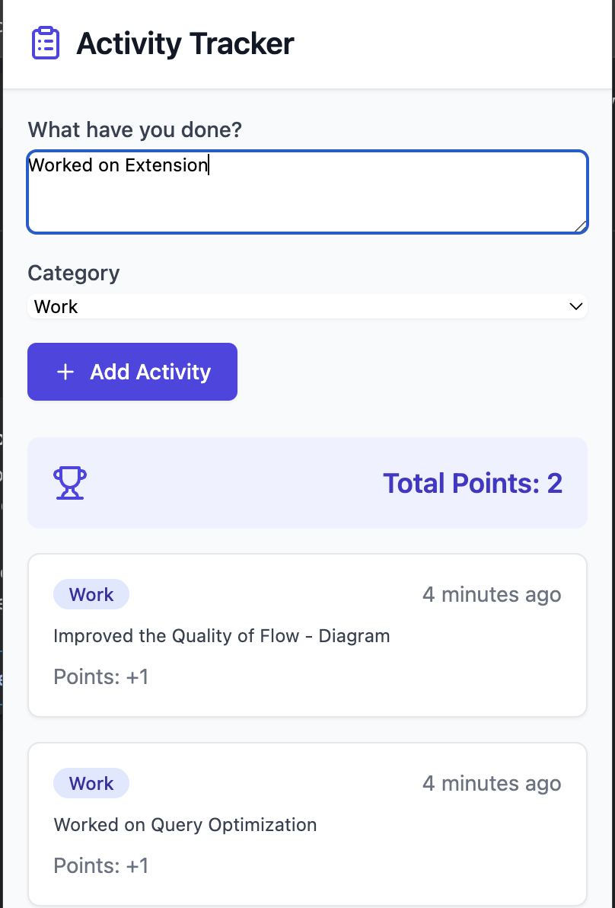

Here’s an example of a **README.md** file for your Chrome extension based on the screenshot you provided:

---

# Activity Tracker Chrome Extension

A lightweight and intuitive Chrome extension to track and organize your daily activities with ease. This tool allows you to log your tasks, categorize them, and track your progress in real-time.



## Features

- **Simple Activity Logging**: Quickly describe and categorize your activities.
- **Point System**: Earn points for each activity added, motivating you to track consistently.
- **Category Management**: Organize activities by predefined or custom categories (e.g., Work, Personal, Study).
- **Progress Overview**: Get a summary of your total points and recent activities at a glance.

## How It Works

1. **Log Your Activity**:
   - In the "What have you done?" field, describe the task or activity you completed.
   - Choose a category from the dropdown (e.g., Work, Personal).
   - Click the **+ Add Activity** button to log it.

2. **Track Progress**:
   - View all logged activities in a timeline.
   - Check your total points, which increase as you log activities.

3. **Stay Organized**:
   - Use the categorized view to filter activities and focus on specific areas of your life.

## Installation

1. Download the project files or clone the repository.
   ```bash
   https://github.com/pkkarn/habit_extension
   ```
2. Open Google Chrome and navigate to `chrome://extensions`.
3. Enable **Developer Mode** in the top right corner.
4. Click **Load unpacked** and select the folder containing the extension files.
5. The Activity Tracker extension will now appear in your Chrome toolbar.

## Technologies Used

- **React, Typescript**: For the UI design.
- **Vite**: For bundling.
- **JavaScript**: For activity logging and progress tracking.
- **Chrome Extension APIs**: To integrate with the Chrome browser.

## Future Enhancements

- Add notifications to remind users to log their activities.
- Provide data analytics for deeper insights into activity patterns.
- Enable export of activity logs to CSV or PDF.

---

Feel free to customize this further based on your project specifics!
